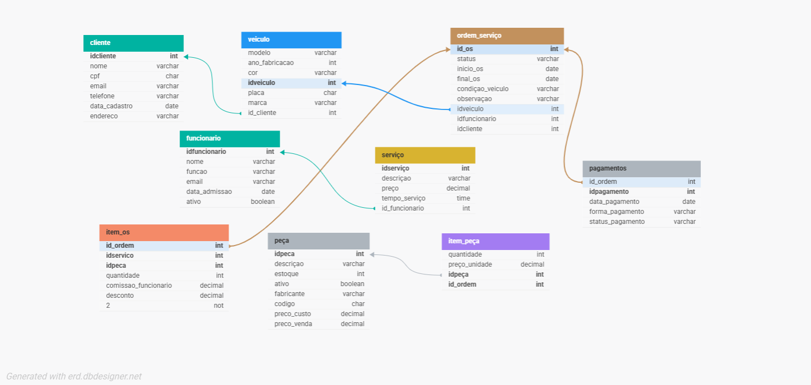

## 📌 Resumo do Projeto

Este projeto apresenta a modelagem e implementação de um **banco de dados relacional para gerenciamento de uma oficina mecânica**.

A estrutura do banco foi desenvolvida a partir de um **modelo conceitual ER (Entidade-Relacionamento)**, posteriormente convertido para o **modelo lógico relacional** e implementado utilizando **SQL**.

O sistema permite o controle de **clientes, veículos, funcionários, serviços, peças, ordens de serviço e pagamentos**, possibilitando registrar atendimentos realizados, peças utilizadas e formas de pagamento associadas às ordens de serviço.

Além da criação das tabelas e inserção de dados para testes, foram desenvolvidas **consultas SQL utilizando cláusulas como `SELECT`, `WHERE`, `JOIN`, `GROUP BY`, `HAVING` e `ORDER BY`**, permitindo extrair informações relevantes, como serviços mais realizados, pagamentos pendentes e histórico de atendimentos por cliente.

O objetivo do projeto é **aplicar na prática os conceitos de modelagem de banco de dados e manipulação de dados em SQL**, simulando um cenário real de gerenciamento de informações em uma oficina mecânica.

